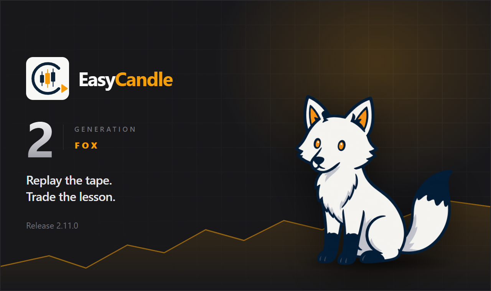

<p align="center">
  
</p>

# Easy Candle

Easy Candle is a desktop app for learning to read the market and practicing trades without live-market pressure. Replay history one candle at a time so you can study price action at your own pace, test your process, and build conviction before you risk real capital.

[](https://github.com/easy-candle/easy-candle/releases/latest)
[](https://github.com/easy-candle/easy-candle/releases/latest)
[](LICENSE)

## Stack

- Electron + electron-vite
- React 19 + TypeScript
- Zustand, lightweight-charts, Tailwind CSS
- electron-builder + electron-updater (GitHub Releases)

## Download

<div align=left>
    <table>
        <thead align="left">
            <tr>
                <th>OS / Arch</th>
                <th>Compatibility</th>
            </tr>
        </thead>
        <tbody align="left">
            <tr>
                <td>
                    <a href="https://github.com/easy-candle/easy-candle/releases/latest/download/easy-candle-2.11.0-setup.exe"></a>
                </td>
                <td>10+</td>
            </tr>
            <tr>
                <td>
                    <a href="https://apps.microsoft.com/detail/9n91gnr9sj14?cid=DevShareMCLPCS&hl=en-US&gl=NL"></a>
                </td>
                <td>10+</td>
            </tr>
            <tr>
                <td>
                    <a href="https://github.com/easy-candle/easy-candle/releases/latest/download/easy-candle-2.11.0-arm64-mac.zip"></a>
                </td>
                <td>10.15+</td>
            </tr>
            <tr>
                <td>
                    <a href="https://github.com/easy-candle/easy-candle/releases/latest/download/easy-candle-2.11.0.AppImage"></a>
                </td>
                <td>
                    GNU/Linux (glibc)
                </td>
            </tr>
        </tbody>
    </table>
</div>

## MetaTrader 5 Expert Advisor

Stream live **M1** OHLC from MetaTrader 5 into Easy Candle over a local WebSocket. Easy Candle is the server (`ws://127.0.0.1:17321`); the EA is the client. Nothing is saved until you confirm **Import from MetaTrader**.

- **Download (compiled):** [EasyCandleBridge.ex5](https://github.com/easy-candle/easy-candle-ea/releases/latest/download/EasyCandleBridge.ex5) — [latest EA release](https://github.com/easy-candle/easy-candle-ea/releases/latest)
- **Source & protocol:** [easy-candle/easy-candle-ea](https://github.com/easy-candle/easy-candle-ea) — see the [EA README](https://github.com/easy-candle/easy-candle-ea/blob/main/README.md) for attach rules, inputs, and the message protocol

### Install

1. Download `EasyCandleBridge.ex5` from the link above (or clone the EA repo and compile `EasyCandleBridge.mq5` in MetaEditor).
2. In MT5, **File → Open Data Folder**, then copy the `.ex5` into `MQL5/Experts/` (or `MQL5/Experts/EasyCandle/`).
3. Restart MT5, or right-click **Navigator → Expert Advisors → Refresh**.
4. **Tools → Options → Expert Advisors**:
   - Enable **Allow algorithmic trading**.
   - Check **Allow WebRequest for listed URL**, click **Add**, and allow **`http://127.0.0.1`**. MT5 will not let the EA open a socket to Easy Candle until this address is on the list. If connect still fails, add `http://127.0.0.1:17321` as well.
   - Turn **AutoTrading** on in the toolbar.
5. Start **Easy Candle** first so it is already listening on `127.0.0.1:17321`.
6. Open the symbol you want on an **M1** chart and attach **EasyCandleBridge**. Other periods are rejected; the Experts journal will say to attach on M1.
7. In Easy Candle open **Import data**. When the preview shows enough history (at least **14,400** M1 bars, ~10 days), click **Import from MetaTrader** and confirm.

Attach **one chart at a time** (a new connection replaces the previous one). After confirm, live bars keep the saved dataset up to date. Default history dump is 100,000 M1 bars (`InpHistoryBars`, clamped 15,000–500,000); details are in the [EA README](https://github.com/easy-candle/easy-candle-ea/blob/main/README.md).

## Develop

Yarn is the package manager for this repo (pinned via `packageManager` in `package.json`); CI installs with `yarn install --frozen-lockfile`.

```bash
yarn install
yarn dev
```

## Test

```bash
yarn test
```

## Package locally (no publish)

```bash
yarn dist          # current platform
yarn dist:win      # Windows NSIS (GitHub Releases installer)
yarn dist:mac
yarn dist:linux
```

Artifacts land in `release/`.

## Release (auto-build + auto-update)

Publishes to [easy-candle/easy-candle](https://github.com/easy-candle/easy-candle) GitHub Releases.

1. Bump `version` in `package.json`
2. Commit and tag: `git tag v2.0.2 && git push origin v2.0.2`
3. GitHub Actions builds Windows (**NSIS** x64 only), macOS (zip arm64), and Linux (AppImage x64) **in parallel with `--publish never`**
4. A single `publish` job then creates one GitHub Release and uploads all installers + `latest*.yml` update metadata (avoids multi-job release races)
5. NSIS/macOS/Linux packaged apps check for updates on startup, ask before downloading, show progress, then offer restart (or install on quit)

Requires `contents: write` on the workflow (already set) so `GITHUB_TOKEN` can create the release.

If a previous tag’s release is incomplete, delete that GitHub Release before tagging a new version.

## License

Apache License 2.0 with a No Commercial Product restriction. You may use and modify Easy Candle for personal or internal use. You may not use this code to sell anything — including a paid app, white-label, or embedding it in a commercial product — without a separate license from the copyright holder. See [LICENSE](LICENSE).
